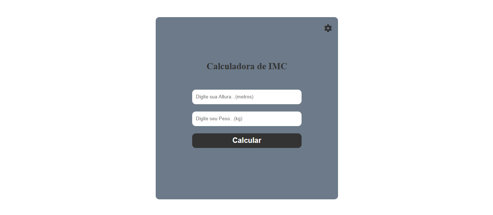
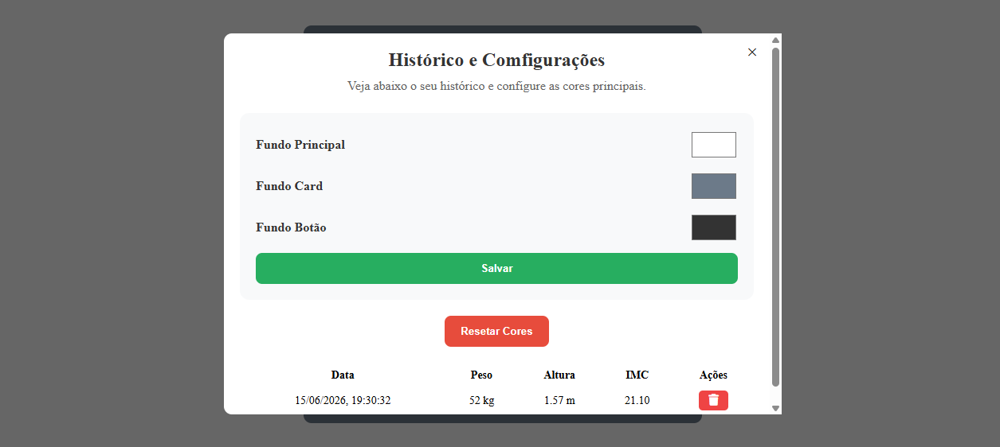

# 📊 Calculadora de IMC

Uma aplicação web simples e responsiva para cálculo do Índice de Massa Corporal (IMC), desenvolvida com HTML, CSS e JavaScript.

## 🚀 Funcionalidades

- ✅ Cálculo do IMC
- ✅ Classificação do resultado
  - Abaixo do peso
  - Peso normal
  - Sobrepeso
  - Obesidade
  - Obesidade Grave
- ✅ Histórico de cálculos
- ✅ Exclusão de registros do histórico
- ✅ Personalização de cores da aplicação
- ✅ Salvamento das configurações no navegador (LocalStorage)
- ✅ Resetar cores para o padrão
- ✅ Exibição da data do cálculo
- ✅ Layout responsivo para desktop e dispositivos móveis
- ✅ Modal de configurações e histórico

---

## 🛠️ Tecnologias Utilizadas

- HTML5
- CSS3
- JavaScript (Vanilla JS)

---

## 📸 Preview

---

## 💾 Armazenamento Local

A aplicação utiliza o LocalStorage do navegador para:

- Salvar o histórico de cálculos
- Salvar as cores personalizadas
- Restaurar as configurações ao recarregar a página

---

## 📚 Aprendizados

Este projeto foi desenvolvido com o objetivo de praticar:

- Manipulação do DOM
- Eventos JavaScript
- LocalStorage
- Responsividade
- Estruturação de projetos Front-End
- Git e GitHub

---

## 👨‍💻 Autor

Desenvolvido por **Carlos André Dias Shinkava**

GitHub:
https://github.com/shinkawa-andre

---